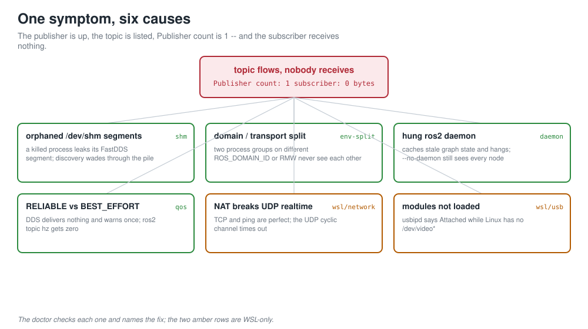
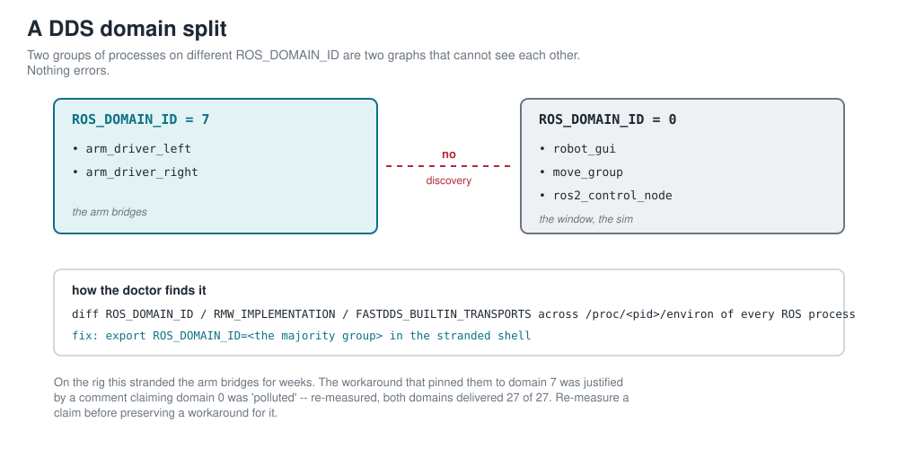
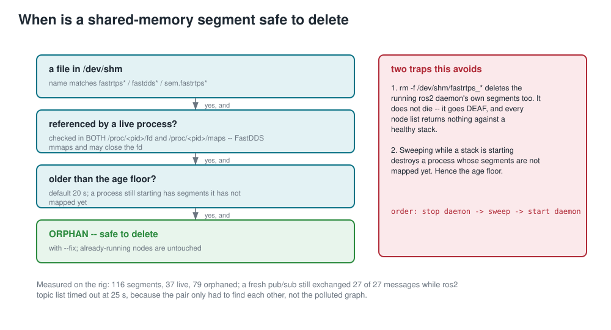
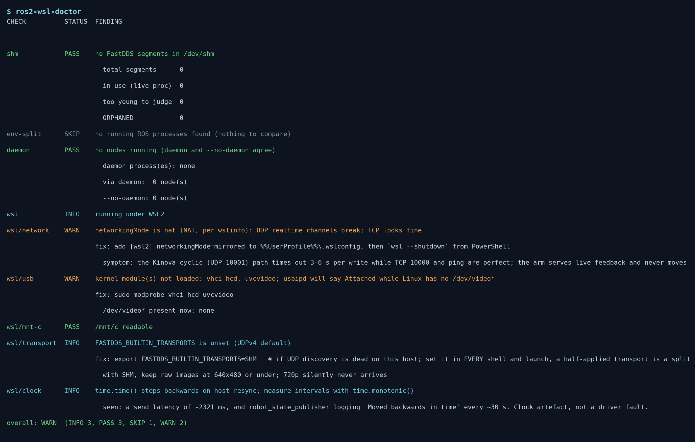

# DDSDetective

**The node is up. The topic exists. `Publisher count: 1`. And no subscriber ever receives a byte.**

That is one fault class with at least five causes, and every one of them looks like a dead camera, a frozen arm or a broken driver from the outside. `ddsdetective-ros2` is a zero-dependency Python tool that checks the environmental causes first, names the one it finds in plain words, and prints the exact fix. It was built on a ROS 2 Jazzy rig running under WSL2, where each of these cost a lab day before it was understood, and it works on plain Linux too.

```
$ ddsdetective-ros2
CHECK          STATUS  FINDING
------------------------------------------------------------
shm            FAIL    79 orphaned FastDDS segment(s) in /dev/shm; new participants must wade through them
                       fix: ddsdetective-ros2 shm --fix   (deletes only the orphans; ...)
env-split      FAIL    DDS domain split: 2 running ROS process groups cannot see each other
                       fix: export ROS_DOMAIN_ID=0 RMW_IMPLEMENTATION=rmw_fastrtps_cpp ...
                         3 proc(s): domain 0, rmw rmw_fastrtps_cpp, transports SHM, ...
                             pid 41210  move_group
                             pid 41377  srl_gui
                         2 proc(s): domain 7, rmw rmw_fastrtps_cpp, transports SHM, ...
                             pid 43008  kortex_highlevel_bridge
daemon         FAIL    stale ros2 daemon: it hung while --no-daemon sees 28 node(s)
                       fix: ros2 daemon stop && ros2 daemon start
wsl/network    WARN    networkingMode is nat (NAT, per wslinfo): UDP realtime channels break; TCP looks fine
```

## The problem

The symptom is always the same: a node at 20-30 % CPU, a topic listed, a blank panel. On the rig this tool comes from, that one symptom turned out to have five different causes, each diagnosed at least once as broken hardware:

1. **Stale `/dev/shm` FastDDS segments.** Every participant gets a segment; every `kill -9`, crash or killed launch leaves one behind. After a day of process churn there were **116 segments, 37 referenced by a live process, 79 orphaned** (another session counted 214). `ros2 topic list` timed out at 25 s against a fully running stack, while a fresh pub/sub pair still exchanged **27 of 27** messages, because that pair only had to find each other, not the polluted graph.
2. **A DDS domain split.** A per-arm CONNECT script did `export ROS_DOMAIN_ID=7` unconditionally while the operator window ran on domain 0. Every panel drew: no arms, no joint states, no cameras, "5 things to fix". Nothing was wrong with any of them. The pin was justified by a comment claiming domain 0's shared memory was "polluted"; re-measured with a minimal pub/sub, **domain 0 delivered 27/27 and domain 7 delivered 27/27**. The pollution had been a stale `/dev/shm` cleared long ago. The workaround outlived its cause and silently split the system in half for weeks.
3. **A stale `ros2` daemon.** After switching WSL to mirrored networking, one terminal said "No ROS 2 nodes at all" while another ran a healthy stack. There was no partition: `ros2 node list --no-daemon` saw **all 28 nodes** the whole time. The daemon caches network state, did not survive the interface change, and hung rather than failing, so a `timeout 20 ros2 node list` returned an empty string, which reads as "nothing is running".
4. **A QoS mismatch.** Camera topics publish BEST_EFFORT (`qos_profile_sensor_data`). A plain `create_subscription(...)` or `ros2 topic hz` is RELIABLE by default and receives nothing. DDS does warn, once, in a line that is easy to miss: `incompatible QoS ... Last incompatible policy: RELIABILITY`. A healthy scene camera was declared dead this way.
5. **The fix that recreates the fault.** The obvious repair, `rm -f /dev/shm/fastrtps_*`, also deletes the running `ros2` daemon's own segments. The daemon does not die; it goes **deaf**. `ros2 node list` then returns nothing against a healthy stack, and the next preflight blamed the simulation: false, specific and confident, which is the worst combination because it sends you to the wrong log. A blind sweep also destroyed a *starting* simulation once, because a process that is still coming up has segments it has not mapped yet.

The other two members of the class, a V4L2 device opened twice and an RTSP camera whose module is wedged while the arm still pings, are hardware-side and live in the companion `camscout-usbip`.



*One symptom -- topic flows, nobody receives -- and the six causes the doctor separates. The two amber rows are WSL-only.*

## Root causes, in one sentence each

- FastDDS shared memory is a namespace with no owner, so anything that dies badly pollutes it for every process that starts afterwards.
- DDS has no way to tell you that two processes are on different domains or transports; they simply never meet.
- The `ros2` CLI daemon is a cache of the graph, and a cache can be stale or hung while the graph is fine.
- Reliability QoS is negotiated per endpoint and an incompatible pair is silent by design.
- WSL2 adds its own traps: NAT breaks UDP realtime channels, USB modules are not loaded by default, `/mnt/c` can die, and the wall clock steps backwards on host resync.

## What the doctor checks

| check | what it looks at | FAIL / WARN when | the fix it prints |
|---|---|---|---|
| `shm` | every `fastrtps*` / `fastdds*` / `sem.fastrtps_*` object in `/dev/shm`, against every live process's `/proc/<pid>/fd` **and** `/proc/<pid>/maps`, with a 20 s age floor | a segment is unreferenced by the kernel's own account and older than the floor | `ddsdetective-ros2 shm --fix` (deletes only those) |
| `env-split` | `ROS_DOMAIN_ID`, `RMW_IMPLEMENTATION`, `FASTDDS_BUILTIN_TRANSPORTS`, `ROS_LOCALHOST_ONLY`, `ROS_AUTOMATIC_DISCOVERY_RANGE` read from each running ROS process's `/proc/<pid>/environ`, plus this shell | more than one group; or this shell differs from the stack; or `ROS_LOCALHOST_ONLY` is set anywhere | the majority group's exports |
| `daemon` | `ros2 node list` under an 8 s timeout against `ros2 node list --no-daemon` | the daemon hangs or returns nothing while `--no-daemon` sees nodes | `ros2 daemon stop && ros2 daemon start` |
| `wsl` | `wslinfo --networking-mode` (falling back to `.wslconfig`), `vhci_hcd` and `uvcvideo` in `/proc/modules`, `/mnt/c` readability, the shell's transport, and a clock note | NAT; modules missing; `/mnt/c` returns EIO | `.wslconfig` mirrored + `wsl --shutdown`; `modprobe`; `wsl --shutdown` |
| `delivery` | a real pub/sub round trip on a chosen domain, counting **arrivals** over a window | fewer than expected arrive | points back at `shm`, `env-split`, transports |
| `qos` | `ros2 topic info -v` for one topic | BEST_EFFORT publisher with a RELIABLE subscriber, or with none yet | `--qos-reliability best_effort` / `qos_profile_sensor_data` |

Checks that need the `ros2` CLI report `SKIP` when it is not on `PATH`, never a crash.



*A DDS domain split: two process groups on different `ROS_DOMAIN_ID` are two graphs that never see each other, and nothing errors. The doctor diffs the environment of every ROS process to find it.*



*How a `/dev/shm` segment is judged safe to delete, and the two traps -- deafening the daemon, destroying a starting stack -- that the age floor and the stop/sweep/start order avoid.*

## Install

```bash
pip install git+https://github.com/megazron/ddsdetective-ros2
```

Python 3.10 or newer, no third-party dependencies. It never imports `rclpy`; anything that needs the graph shells out to the `ros2` CLI under a timeout, so it runs from any shell, sourced or not.

## Quickstart

```bash
ddsdetective-ros2                         # every check, plain-text table, exit 1 on any FAIL
ddsdetective-ros2 --json                  # the same as JSON, for scripts and CI
ddsdetective-ros2 shm                     # report orphaned segments
ddsdetective-ros2 shm --fix               # delete only the orphans, leave everything a live process maps
ddsdetective-ros2 shm --fix --restart-daemon   # also cycle a running ros2 daemon so its stale segments go too
ddsdetective-ros2 env-split               # who is on which domain / transport, and is this shell with them
ddsdetective-ros2 env-split --match my_   # count extra processes as ROS by regex on their cmdline
ddsdetective-ros2 daemon                  # daemon versus --no-daemon
ddsdetective-ros2 wsl                     # NAT, USB modules, /mnt/c, transports, clock
ddsdetective-ros2 delivery --domain 7 --expected 20   # prove delivery on a domain
ddsdetective-ros2 qos /scene_camera/image_raw          # the reliability trap
```

A good habit on a machine like the one this came from: run it first, before blaming the code.

```bash
ddsdetective-ros2 --quiet || echo "fix the environment before debugging the stack"
```

## Reading the output

- **PASS / WARN / FAIL / SKIP / INFO** per line, `fix:` underneath when there is one, indented detail lines under that. `--quiet` hides the detail lines.
- The exit code is 1 only on a FAIL, so a WARN never breaks a script.
- `env-split` lists every group with its PIDs and names, largest first. The fix it prints is the majority group's environment. The minority is usually the thing you just started; restart it under those exports.
- `shm` will tell you when segments were left alone because they are younger than the age floor. That is a process still starting, not a bug. Run again in half a minute.
- `wsl/network` reports what WSL is running now (`wslinfo`) and notes when `.wslconfig` says something else; the file only takes effect after `wsl --shutdown`.



*The doctor's real output on a WSL2 laptop: shared memory clean, no split, but NAT networking and unloaded usbip modules flagged before they cost a lab session.*

## Python API

Every check is a function returning a `Finding` (`check`, `status`, `finding`, `fix`, `details`), so the doctor drops into a launch preflight or a GUI connection panel.

```python
from ros2_wsl_doctor import shm, env_split, daemon, wsl, delivery
from ros2_wsl_doctor.report import Status, render_table

findings = [shm.check(), env_split.check(), daemon.check(), *wsl.checks()]
print(render_table(findings))
if any(f.status == Status.FAIL for f in findings):
    raise SystemExit("environment first")

# lower-level pieces
survey = shm.survey()                 # ShmSurvey(total, in_use, orphaned, too_young)
groups = env_split.group(env_split.scan())   # {(domain, rmw, transports, ...): [RosProc, ...]}
delivery.delivery_test(domain=7, expected=20)
delivery.qos_check("/camera/image_raw")
```

`shm.survey`, `env_split.scan` and `wsl.checks` take root paths (`proc_root`, `shm_root`, `proc_version`, `users_root`, ...) so they can be pointed at a fake tree; the test suite does exactly that and needs no ROS, no hardware and no WSL.

## Design rules

These are the rules the tool follows, each learned the expensive way:

- **Delete only what the kernel says is unreferenced.** A segment counts as orphaned when no live process has it open *or* mapped, and it is older than an age floor. Never the broad `rm -f /dev/shm/fastrtps_*`: that deafens the daemon and can kill a starting stack.
- **Read the environment a process is actually using.** `/proc/<pid>/environ`, not a config file that may since have been edited, and not what your own shell happens to have.
- **Count arrivals, never presence.** A topic being listed proves the publisher exists. Only messages arriving over a window prove delivery. A readiness check that tests the former will say READY with no headset in the building.
- **Never `pkill` broad patterns while a stack you want is running.** Kill explicit PIDs, and prefer SIGINT: SIGKILL is how the segments got orphaned in the first place, and on some hardware (a Kinova arm permits exactly one API session) SIGKILL leaks the session as well.
- **Re-measure a claim before preserving a workaround for it.** "Domain 0 is polluted" was true for one afternoon and enforced for weeks. A comment asserting an environment fact is a claim with a date.
- **A check that cannot pass is worse than no check.** Prove a new probe against a known-good system before trusting a negative from it.

## Origin

Built during an MSc project at Imperial College London: a wearable dual-arm supernumerary-limb rig with two Kinova Gen3 arms, teleoperated from an instrumented master mannequin and from a Quest headset, running ROS 2 Jazzy under WSL2. Every number above was measured on that machine. The project repository is [Multimodal control of a wearable dual-arm robotic system for assisted object manipulation](https://github.com/megazron/Multimodal-control-of-a-wearable-dual-arm-robotic-system-for-assisted-object-manipulation).

Companion toolkits from the same project: `camscout-usbip`, `shortstop-sim2real`, `twin-truth`, `smoothoperator-teleop`.

## Figures

Every figure in `docs/img/` is regenerated by `python3 docs/make_figures.py`; the output panel is captured from a real run on this machine.

## License

MIT, Gaus Mohiuddin Sayyad, 2026.
